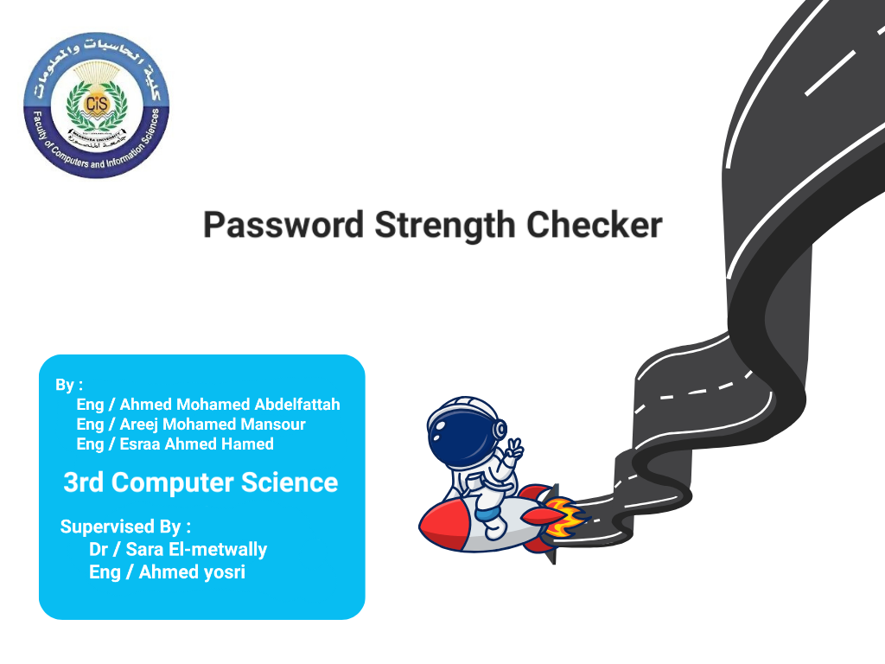

# Password Strength Checker

This repository contains an **Assembly Language** project developed using **TASM (Turbo Assembler)**. The program evaluates the strength of user-provided passwords and offers detailed feedback to encourage the creation of more secure passwords.

## Features

The password strength checker includes the following functionalities:

1. **Password Validation**:
   - Ensures the password meets specific security criteria.

2. **Checks for the Presence of**:
   - **Uppercase Letters**: At least one uppercase character.
   - **Lowercase Letters**: At least one lowercase character.
   - **Digits**: At least one numerical digit.
   - **Special Characters**: At least one special character (e.g., `@, #, $, etc.`).

3. **Minimum Length Requirement**:
   - Verifies that the password meets a predefined minimum length.

4. **Username Validation**:
   - Ensures the password is not identical to the username.

5. **Feedback System**:
   - Provides specific guidance on why a password is weak and how to improve it.

6. **Lockout Mechanism**:
   - Prevents further attempts after three consecutive weak password entries.

## Technologies Used

- **Assembly Language** (8086 architecture)
- **TASM (Turbo Assembler)**
